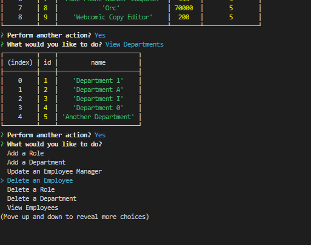

# Employee Tracker

## Table of Contents

1. [Description](#description)
2. [Installation](#installation)
3. [Usage](#usage)
4. [License](#license)
5. [Screenshot](#screenshot)
6. [Walkthrough Video](#walkthrough)

## Description:
Completed as a homework assignment for Washington University's Fullstack Web Development Program. The purpose of the application is using inquirer.js to ask the user for a series of prompts and be able to manipulate MySQL tables. Example tables included a table for department, roles, and employees in a fictional company.

## Usage:
Intallation will consist of generating tables using the schema.sql. Seed.sql is provided for users who would like false data to work with. The application is dependent on npm inquirer and npm MySQL to function.

Upon running the application, it will prompt the user with a series of options about how they would like to manipulate the MySQL tables(provided in schema.sql).

-View Employees renders the employee table to the terminal.

-View Roles renders the roles table to the terminal.

-View Departments renders the department table to the terminal.

-View by Employees by Manager allows the user to select an employee from the employee table and view a table of all the employees working under that employee.

-View Total Cost of a Department sums the the salaries of every employee working for a department.

-Add an Employee gives the user a series of prompts to assist the user in constructing a new employee entry to the employee table.

-Add a Role gives the user a series of prompts to assist the user in constructing a new role entry to the roles table.

-Add a Department gives the user a series of prompts to assist the user in constructing a new department to the department table.

-Update an Employee Manager allows the user to select an employee and assign a new manager to them from the list of employees.

-Delete an Employee allows the user to delete an employee from the list of employees.

-Delete a Role allows the user to delete a roles from the list of roles.

-Delete a Department allows the user to delete a department from the list of departments.

## License: 
MIT

## Screenshot: 

## Walkthrough:
[Link to Walkthrough Video!](https://drive.google.com/drive/folders/1OnADLzX_jZacfchbDS_yCszsTkBkI7e0)

## Created By: 
[Myrmoxenus](https://github.com/Myrmoxenus)
